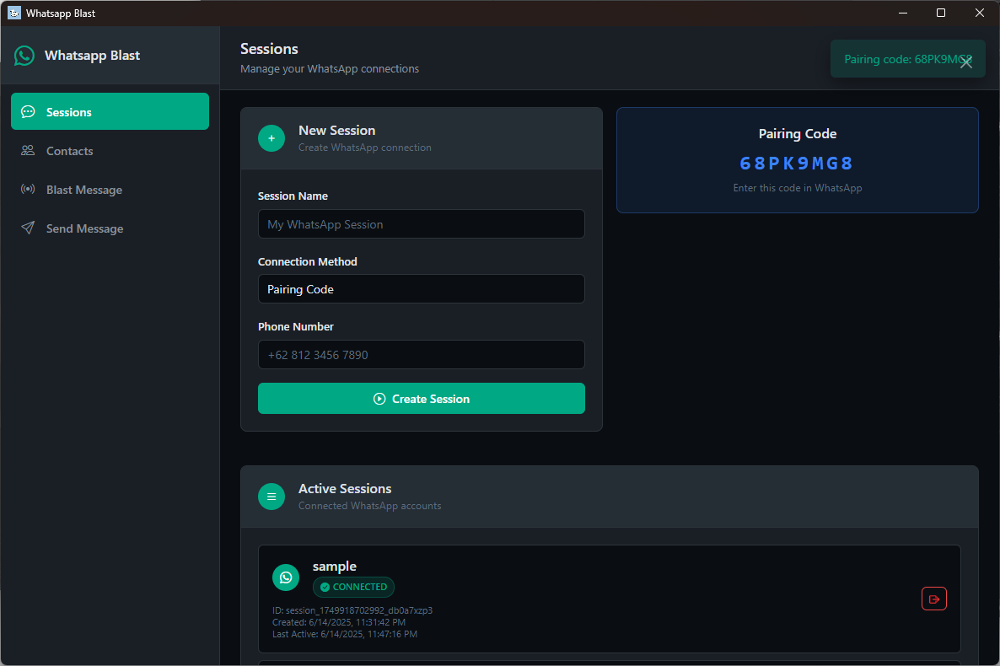

<div align="center">

<h4> # WhatsApp Blast Desktop 
</div>


A modern desktop application for managing WhatsApp sessions and sending bulk messages. Built with Electron and designed with a sleek dark theme interface.


## 🚀 Features

- **Multi-Session Management** - Connect and manage multiple WhatsApp accounts simultaneously
- **QR Code & Pairing Code Support** - Two convenient ways to connect your WhatsApp
- **Contact Import** - Import contacts from Excel files for easy management
- **Bulk Messaging** - Send messages to multiple contacts across multiple sessions
- **Single Message Send** - Send individual messages to specific contacts
- **Modern Dark UI** - Sleek, desktop-optimized interface with WhatsApp's signature green theme
- **Real-time Updates** - Live session status monitoring and updates

## 📸 Screenshots

### Main Dashboard

*Clean, modern interface showing all connected WhatsApp sessions*

### QR Code Connection

*Simple QR code scanning for quick WhatsApp connection*

### Pairing Code Connection

*Alternative pairing code method for device linking*

### Contact Management

*Easy Excel import for contact management*

### Bulk Messaging

*Send messages to multiple contacts with session selection options*

### Single Message

*Send individual messages to specific contacts*

## 🛠️ Installation

### Prerequisites
- Node.js (v14 or higher)
- npm or yarn package manager

### Setup

1. **Clone the repository**
   ```bash
   git clone https://github.com/fdciabdul/Whatsapp-Blast-Desktop.git
   cd Whatsapp-Blast-Desktop
   ```

2. **Install dependencies**
   ```bash
   npm install
   ```

3. **Run the application**
   ```bash
   npm start
   ```

### Build for Production

```bash
# For Windows
npm run build:win

# For macOS
npm run build:mac

# For Linux
npm run build:linux
```

## 📋 Usage

### 1. Creating a Session
1. Navigate to the **Sessions** tab
2. Enter a unique session name
3. Choose connection method:
   - **QR Code**: Scan with your phone's WhatsApp
   - **Pairing Code**: Enter the code in WhatsApp settings
4. Click "Create Session"

### 2. Importing Contacts
1. Go to the **Contacts** tab
2. Click "Import Excel"
3. Select your Excel file with contact information
4. Contacts should include columns like `Name`, `Phone`, etc.

### 3. Sending Bulk Messages
1. Open the **Blast Message** tab
2. Select sessions using:
   - **Select All**: Choose all connected sessions
   - **Random**: Pick one random session
   - **Manual**: Check individual sessions
3. Type your message
4. Click "Send Blast Message"

### 4. Single Message
1. Navigate to **Send Message** tab
2. Select a connected session
3. Enter recipient phone number (with country code)
4. Type your message
5. Click "Send Message"

## 📝 Excel Format for Contacts

Your Excel file should contain the following columns:

| Name | Phone | 
|------|-------|
| John Doe | +1234567890 |
| Jane Smith | +6281234567890 |

Supported column names:
- `Name` or `name`
- `Phone`, `phone`, `Number`, `number`, `phoneNumber`

## ⚙️ Configuration

### Country Codes
Currently supports Indonesia (+62). You can extend support by modifying the `countryCodes` object in `renderer.js`:

```javascript
const countryCodes = {
    '62': { name: 'Indonesia', length: [10, 11, 12] },
    '1': { name: 'United States', length: [10] },
    // Add more country codes as needed
}
```

## 🔧 Technical Details

### Built With
- **Electron** - Desktop app framework
- **Bootstrap 5** - UI framework with dark theme
- **Bootstrap Icons** - Icon library
- **WhatsApp Web API** - For WhatsApp connectivity

### File Structure
```
├── main.js              # Electron main process
├── renderer.js          # UI logic and interactions
├── index.html           # Main UI layout
├── package.json         # Dependencies and scripts
└── assets/              # Images and resources
```

## 🛡️ Security & Privacy

- All WhatsApp sessions are stored locally on your device
- No data is transmitted to external servers
- Messages are sent directly through WhatsApp's official API
- Session data is encrypted and secure

## 🐛 Troubleshooting

### Common Issues

**Session won't connect**
- Ensure your phone has internet connection
- Try refreshing the QR code
- Check if WhatsApp Web is already active on another device

**Import fails**
- Verify Excel file format (.xlsx or .xls)
- Check column names match expected format
- Ensure phone numbers include country codes

**Messages not sending**
- Verify session is connected (green status)
- Check recipient phone number format
- Ensure you have an active internet connection


## 📄 License

This project is licensed under the MIT License - see the [LICENSE](LICENSE) file for details.

## Note

The whatsapp Script i've obfuscated, if you want to get the unobfuscated, you can contact me on telegram

- [@imtaqin](https://t.me/imtaqin) 

## ⚠️ Disclaimer

This tool is for educational and legitimate business purposes only. Please comply with WhatsApp's Terms of Service and local regulations regarding bulk messaging. The developers are not responsible for any misuse of this software.


## 📞 Support

If you encounter any issues or have questions:

1. Check the [Issues](https://github.com/fdciabdul/Whatsapp-Blast-Desktop/issues) page
2. Create a new issue with detailed information
3. Include screenshots and error messages if applicable

---

<div align="center">
  Made with ❤️ by <a href="https://github.com/fdciabdul">fdciabdul</a>
</div>